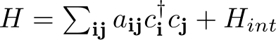
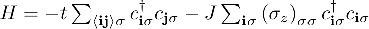

[](https://zenodo.org/badge/latestdoi/50950512)
[](https://travis-ci.org/dafer45/TBTK)  
<a href="https://www.patreon.com/bePatron?u=12043676" data-patreon-widget-type="become-patron-button"></a>  
**Contact:** <kristofer.bjornson@second-tech.com>  
**Publication:** https://doi.org/10.1016/j.softx.2019.02.005  
**Full documenation:** http://www.second-quantization.com/  
**Also see:** http://www.second-tech.com

*Always work against a versioned release. See "Quickstart" below for instructions on how to checkout the latest release.*

# TBTK
Welcome to TBTK, a library for modeling and solving second quantized Hamiltonians with discrete indices.
That is, Hamiltonians of the form  
<p align="center"></p>  
TBTK itself originated as a Tight-Binding ToolKit, and currently have complete support for modeling and solving the first bilinear term.
However, the scope of TBTK has expanded vastly since its inception.
It is today more generally a collection of data structures that are meant to enable rapid development of new algorithms for both interacting and non-interacting systems.
Examples include general purpose data structures for quantities such as the Density, DOS, EigenValues, (spin-polarized) LDOS, Magnetization, WaveFunctions, etc.
In addition to providing native solvers, TBTK also aims to enable the development of frontends and backends to already existing packages.
Thereby allowing for seamless integration with the codebase already developed by the scientific community.
To aid such integration, TBTK is specifically designed to allow for solution algorithms to be used interchangably with minimal amount of modification of the code.  
<br/><br/>

# Example
Consider the tight-binding Hamiltonian  
<p align="center"></p>  

on a square lattice of size 30x30, where angle brackets denotes summation over nearest neighbors, and *sigma* is a spin summation index.
The parameters *t = 1 eV* and *J = 0.5 eV* are the nearest neighbor hopping amplitude and the strength of the Zeeman term, respectively.
Moreover, let the chemical potential be *mu = -1 eV*, the temperature be *T = 300K*, and the particles have Fermi-Dirac statistics.  
```cpp
const int SIZE_X                = 30;
const int SIZE_Y                = 30;
const double t                  = 1;
const double J                  = 0.5;
const double T                  = 300;
const Statistics statistics     = Statistics::FermiDirac;
```

Now assume that we are interested in calculating the density of states (DOS) and magnetization for the system.
For the DOS we want to use the energy window [-10, 10] and an energy resolution of 1000 points.  
```cpp
const double LOWER_BOUND        = -10;
const double UPPER_BOUND        = 10;
const int RESOLUTION            = 1000;
```
In addition we decide that the appropriate solution method for the system is diagonalization.
We proceed as follows.

## Setup the model  
```cpp
Model model;
for(int x = 0; x < SIZE_X; x++){
        for(int y = 0; y < SIZE_Y; y++){
                for(int s = 0; s < 2; s++){
                        //Add nearest neighbor hopping (HC for Hermitian conjugate).
                        if(x+1 < SIZE_X)
                                model << HoppingAmplitude(-t, {x+1, y, s}, {x, y, s}) + HC;
                        if(y+1 < SIZE_Y)
                                model << HoppingAmplitude(-t, {x, y+1, s}, {x, y, s}) + HC;

                        //Add Zeeman term.
                        model << HoppingAmplitude(-J*2*(1/2. - s), {x, y, s}, {x, y, s});
                }
        }
}
//Create Hilbert space basis.
model.construct();

//Set the chemical potential, temperature, and statistics.
model.setChemicalPotential(mu);
model.setTemperature(T);
model.setStatistics(statistics);
```

## Select solution method  
```cpp
Solver::Diagonalizer solver;
solver.setModel(model);
solver.run();
```

## Calculate properties  
```cpp
PropertyExtractor::Diagonalizer propertyExtractor(solver);
propertyExtractor.setEnergyWindow(LOWER_BOUND, UPPER_BOUND, RESOLUTION);

//Calculate the DOS.
Propery::DOS dos = propertyExtractor.calculateDOS();

//Calculate the Magnetization for all x and y values by passing the wildcard
//_a_ in the correpsonding positions. IDX_SPIN is used to tell the
//PropertyExtractor which subindex that corresponds to spin.
Property::Magnetization magnetization
        = propertyExtractor.calculateMagnetization({{_a_, _a_, IDX_SPIN}});
```

## Plot and print results  
The DOS is a one-dimensional function of the energy and can easily be plotted.
We here do so using a Gaussian smoothing with standard deviation 0.07.  
```cpp
Plotter plotter;
plotter.setLabelX("Energy");
plotter.setLabelY("DOS");
plotter.plot(dos, 0.07);
plotter.save("figures/DOS.png");
```
**Result:**
<p align="center"></p>  

For each point (x, y) on the lattice, the magnetization is a two-by-two complex matrix called a SpinMatrix.
The up and down components of the spin are given by the two diagonal entries.
We can therefore print the magnetization (the real part of the difference between the up and down components) at site (10, 10) as follows.
```cpp
SpinMatrix m = magnetization({10, 10, IDX_SPIN});
Streams::out << "Magnetization:\t" << real(m.at(0, 0) - m.at(1, 1)) << "\n";
```
**Result:**
```bash
Magnetization:	0.144248
```

## Additional solution methods and properties
The example above demonstrates the general workflow for writing a TBTK application, but the solution method and quantities calculated can vary.
The following is a list of native production ready solvers.
* [Diagonalizer](http://www.second-quantization.com/Solvers.html#SolverDiagonalizer)
* [BlockDiagonalizer](http://www.second-quantization.com/Solvers.html#SolverBlockDiagoanlizer)
* [ArnoldiIterator](http://www.second-quantization.com/Solvers.html#SolverArnoldiIterator)
* [ChebyshevExpander](http://www.second-quantization.com/Solvers.html#SolverChebyshevExpander)

The list of production ready properties is.
* [Density](http://www.second-quantization.com/Properties.html#Density)
* [DOS](http://www.second-quantization.com/Properties.html#DOS)
* [EigenValues](http://www.second-quantization.com/Properties.html#EigenValues)
* [LDOS](http://www.second-quantization.com/Properties.html#LDOS)
* [Magnetization](http://www.second-quantization.com/Properties.html#Magnetization)
* [SpinPolarizedLDOS](http://www.second-quantization.com/Properties.html#SpinPolarizedLDOS)
* [WaveFunctions](http://www.second-quantization.com/Properties.html#WaveFunctions)

For more examples and complete applications, see http://second-tech.com/wordpress/index.php/tbtk/ and the templates in the Templates folder.

# System requirements
**Verified to work with:**  
* gcc (v4.9 and up)
* clang (exact version number not known at the moment).  

| Required software  | Further information  |
|--------------------|----------------------|
| git                | https://git-scm.com/ |
| CMake              | https://cmake.org/   |

| Required libraries | Further information          |
|--------------------|------------------------------|
| BLAS               | http://www.netlib.org/blas   |
| LAPACK             | http://www.netlib.org/lapack |

Additional features will also be available if one or more of the following libraries are installed.

| Optional libraries | Further information                         |
|--------------------|---------------------------------------------|
| ARPACK             | http://www.caam.rice.edu/software/ARPACK    |
| FFTW3              | http://www.fftw.org                         |
| OpenCV             | https://opencv.org                          |
| cURL               | https://curl.haxx.se                        |
| SuperLU (v5.2.1)   | http://crd-legacy.lbl.gov/~xiaoye/SuperLU   |
| wxWidgets          | https://www.wxwidgets.org                   |
| CUDA               | https://developer.nvidia.com/cuda-downloads |
| HDF5               | https://support.hdfgroup.org/HDF5           |
| OpenBLAS           | https://www.openblas.net/                   |
| OpenMP             | https://www.openmp.org/                     |
| Google Test        | https://github.com/google/googletest        |

The following table shows the optional libraries that are required to enable extensions to the core capabilities.
See the documentation for deatiled information about the corresponding components.

| Extensions                                                                                                                | ARPACK | FFTW3 | OpenCV | cURL | SuperLU (v5.2.1) | CUDA | HDF5 | OpenBLAS | OpenMP | Google Test |
|---------------------------------------------------------------------------------------------------------------------------|:------:|:-----:|:------:|:----:|:----------------:|:----:|:----:|:--------:|:------:|:-----------:|
| [ArnoldiIterator](http://www.second-quantization.com/Solvers.html#SolverArnoldiIterator)                                  | X      |       |        |      | X                |      |      |          |        |             |
| [FourierTransform](http://www.second-quantization.com/FourierTransform.html)                                              |        | X     |        |      |                  |      |      |          |        |             |
| [Plotter](http://www.second-quantization.com/Plotting.html)                                                               |        |       | X      |      |                  |      |      |          |        |             |
| [Resource](http://www.second-quantization.com/ImportingAndExportingData.html)                                             |        |       |        | X    |                  |      |      |          |        |             |
| [Enable GPU execution for the ChebyshevExpander](http://www.second-quantization.com/Solvers.html#SolverChebyshevExpander) |        |       |        |      |                  | X    |      |          |        |             |
| [FileReader and FileWriter](http://www.second-quantization.com/ImportingAndExportingData.html#FileReaderAndFileWriter)    |        |       |        |      |                  |      | X    |          |        |             |
| Improved linear algebra performance                                                                                       |        |       |        |      |                  |      |      | X        |        |             |
| Parallel CPU execution of various algorithms                                                                              |        |       |        |      |                  |      |      |          | X      |             |
| Unit testing                                                                                                              |        |       |        |      |                  |      |      |          |        | X           |

A number of experimental features are also enabled by the optional libraries.
These components are not yet stable and rapid changes to their interfaces may occur.
They should therefore only be considered for use by experienced developers.

| Experimental extensions | OpenCV | cURL | SuperLU (v5.2.1) | wxWidgets |
|-------------------------|:------:|:----:|:----------------:|:---------:|
| RayTracer               | X      |      |                  |           |
| DataManager             |        | X    |                  |           |
| LinnearEquationSolver   |        |      | X                |           |
| LUSolver                |        |      | X                |           |
| GUI                     |        |      |                  | X         |

# Quickstart
## Installation
```bash
git clone http://github.com/dafer45/TBTK
git checkout v1.1.1
mkdir TBTKBuild
cd TBTKBuild
cmake ../TBTK
make
sudo make install
```

## Run unit tests (optional, requires Google Test to be installed)
```bash
make test
```

## Create a first application
```bash
cd ..
mkdir TBTKApplications
cd TBTKApplications
TBTKCreateAppliaction MyFirstApplication
cd MyFirstApplication
```

## Build and run the application
```bash
cmake .
make
./build/Application
```

# License
TBTK is free software that is licensed under the Apache 2.0 license (see the file
"License").  Please give attribution in accordance with the "Cite" section below.

### Third party license
#### json/TBTK/json.hpp (for serialization)
A third-party library hosted at https://github.com/nlohmann/json and is licensed
under the MIT license. Similarly the Boost header file gnuplot-iostream.h in
External/TBTK/External/Boost/ is licensed under the Boost license.


# Cite
#### To cite TBTK, mention TBTK in the text and cite
Kristofer Björnson, TBTK: A quantum mechanics software development kit, SoftwareX 9, 205-210 (2019).  

#### If you use the ChebyshevExpander to produce results, please also cite the following references:
A. Weiße, G. Wellein, A. Alvermann, and H. Fehske,  
Rev. Mod. Phys. 78, 275 (2006).

L. Covaci, F. M. Peeters, and M. Berciu,  
Phys. Rev. Lett. 105, 167006 (2010).
